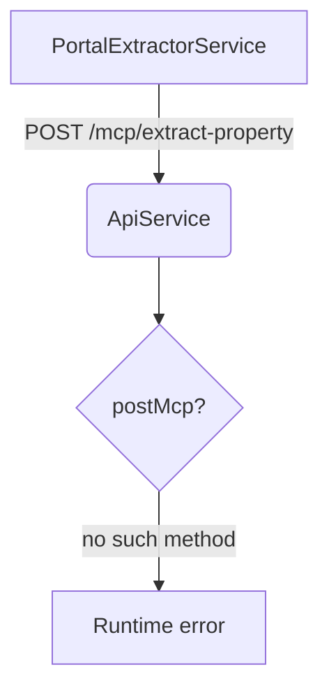

# HomeTruth Code Review Findings

## 1. Quick integrity scan – headline findings

| Area                             | Result | Why it matters                                                                                                                                                                                                                                   |
| -------------------------------- | ------ | ------------------------------------------------------------------------------------------------------------------------------------------------------------------------------------------------------------------------------------------------ |
| Build will fail                  | ❌     | mcpService calls api.postMcp / getMcp – those methods don't exist (only mcpRequest). Runtime exception as soon as any MCP helper is invoked.                                                                                                     |
| API base URL mismatch            | ❌     | extension_config.js → https://api.hometruth.uk/v1 ; ApiService → https://api.hometruth.co.uk/api. All network calls 404 in production unless domains aligned.                                                                                    |
| Legacy / wrong-project code      | ⚠️     | mcpService is still the WhatsApp/Meta extractor from another repo (talks about chats, contacts, etc.). Dead code; pollutes bundle & confuses devs. Remove or replace with property-specific service.                                             |
| Error-monitoring helpers         | ⚠️     | errorMonitoringService exposes reportMcpError, but the method is never defined (only reportExtractionError / reportApiError). All calls to reportMcpError will throw silently.                                                                   |
| Sentry initialisation duplicated | ⚠️     | initialize() + initializeSentry() configure Sentry twice with different options. Double–init = duplicated events & extra bundle size; keep one path.                                                                                             |
| Pricing now consistent?          | ✅     | Docs under docs/user/\* and extension_config.js all state £ 4.99 / £ 49.99. Old £ 7.99 wording lingers only in a few historical docs (search: "7.99"). Do a quick global replace to avoid App Store rejection for "false advertising".           |
| AI plumbing missing              | ❌     | No OpenAIService / orchestration layer on either client or server; nothing wires into the analysis pipeline. Core feature gap – see section 3 for spec.                                                                                          |
| Type/logic nits                  | -      | extractLeaseholdYears returns null even if keyword "years remaining" is in description.<br>- extractTenure only checks description & features, not the dedicated DOM fields in MCP response. Won't break build but reduces Trust Score accuracy. |

## 2. What to fix immediately



### Replace postMcp / getMcp calls

```diff
- const res = await this.apiService.postMcp('/extraction/initialize', params)
+ const res = await this.apiService.mcpRequest('/extraction/initialize', params)
```

- Add missing helpers in ApiService or rename all calls (mcpRequest(method=POST|GET, …) is simplest).
- Rip out legacy WhatsApp methods in mcpService or move them behind a feature flag; they bloat ~25 KB and confuse code-owners.
- Consolidate Sentry bootstrap into one function; keep beforeSend PII scrub there.
- Align API domain – decide on .uk or \*\*.co.uk\_ once, update:

```javascript
production: "https://api.hometruth.uk/api";
```

- Implement / stub reportMcpError in errorMonitoringService.

## 3. 💡 OpenAI integration — technical specification

Goal: turn raw MCP property blobs into Fact-check, Photo, Price, Location insights + Trust Score within < 3 s P95.

### 3.1 Service layout

| Component          | Scope                                                                                    | Tech                   | Repo / path                        |
| ------------------ | ---------------------------------------------------------------------------------------- | ---------------------- | ---------------------------------- |
| OpenAIOrchestrator | Single entry point called by /api/ask                                                    | Node 18 + TypeScript   | backend/src/openai/orchestrator.ts |
| Prompt builder     | Deterministic prompt templates per insight                                               | EJS or string-literals | backend/src/openai/prompts/        |
| Function registry  | Maps OpenAI function-calling to internal utils: fetch_comparables, get_crime_stats, etc. | JSON Schema + zod      | backend/src/openai/functions.ts    |
| Cache              | 24 h LRU keyed by {portalId, versionHash}                                                | Redis                  | redis://…                          |
| Streaming gateway  | SSE → Service Worker → content script                                                    | express-sse            | /api/ask route                     |

### 3.2 Environment variables

```
OPENAI_API_KEY = sk-…
OPENAI_MODEL = gpt-4o-mini # initial – switchable
OPENAI_TEMPERATURE = 0.2
OPENAI_QPM_LIMIT = 60
CACHE_TTL_SECONDS = 86400
```

### 3.3 TypeScript interface

```typescript
export interface OpenAIRequest {
  listing: StandardisedProperty; // output of PortalExtractorService
  userContext?: { id: string; isPremium: boolean };
}

export interface OpenAIResponse {
  trustScore: number; // 0-100
  factCheck: FactCheckSection;
  photoAnalysis: PhotoSection;
  priceAnalysis: PriceSection;
  locationAnalysis: LocationSection;
  rawModelAnswer?: string; // kept 24 h for audit
}
```

### 3.4 Orchestrator algorithm

```typescript
async function analyse(req: OpenAIRequest): Promise<OpenAIResponse> {
  const cacheKey = hash(req.listing.id + OPENAI_MODEL);
  if (await redis.exists(cacheKey)) return redis.get(cacheKey);

  const { messages, functions } = buildPrompt(req);
  const stream = await openai.chat.completions.create({
    model: process.env.OPENAI_MODEL,
    temperature: +process.env.OPENAI_TEMPERATURE,
    stream: true,
    messages,
    functions,
  });

  const parsed = await parseStream(stream); // handles fn calls
  await redis.set(cacheKey, parsed, "EX", CACHE_TTL);
  return parsed;
}
```

### 3.5 Prompt skeleton

```yaml
system:
  You are HomeTruth AI. Return JSON that conforms to the supplied schema.

user:
  <markdown-table with key property facts>

assistant (function_call):
  name: compute_trust_score
  arguments: { … }

➡︎ Tool functions resolve and return JSON payloads that go back into the chat.
```

### 3.6 Error & rate-limit handling

HTTP 429 / context-length > 128k → fall back to gpt-3.5-turbo with summarised prompt.

Record openai_retry_count, openai_latency_ms in Sentry breadcrumbs for each request.

### 3.7 CI guard

GitHub Action runs npm run openai:test which hits OpenAI with tiny mock listing and asserts schema validity.

Fails pull-request if JSON doesn't match zod schema.

## 4. Is the role of AI clear?

**Pros:**

- PRD, Stage-2 guide and Tech Delivery Guide state what AI does (fact-check, price, etc.).
- Sequence diagrams show "OpenAI Orchestrator".

**Gaps:**

- No explicit contract (schema) between extractor and AI.
- No latency / cost budgets in docs.
- No fallback behaviour when OpenAI unavailable.
- End-user docs never explain that answers are AI-generated & may be inaccurate (needed for FCA / Google policy).

**Recommendation:** add a short disclaimer to user-facing docs and include the spec (section 3) in docs/openai_integration.md so devs have a single source of truth.

## 5. Next steps checklist (ordered)

1. Patch compile-breaking issues (section 2).
2. Commit the OpenAI integration scaffold (section 3).
3. Delete / quarantine WhatsApp-style code paths.
4. Harmonise api.hometruth.uk vs api.hometruth.co.uk, then run E2E tests.
5. Update docs: pricing, AI disclaimer, link to new openai_integration.md.
6. Ship a thin vertical slice (Rightmove only) to staging, assert full "click → answer" loop in < 3 s median.
7. Once those are green you can move down the priority list in docs/tech_delivery_guide.md.

## Happy path timeline (abridged)

| Day   | Deliverable                                     |
| ----- | ----------------------------------------------- |
| D0-D1 | Fix build breakers, push patch release 1.2.2    |
| D2-D4 | Implement OpenAIOrchestrator + caching          |
| D5    | Add /api/ask route, smoke test in staging       |
| D6-D7 | Update UI to stream answer; user disclaimer; QA |
| D8    | Beta to internal users                          |
